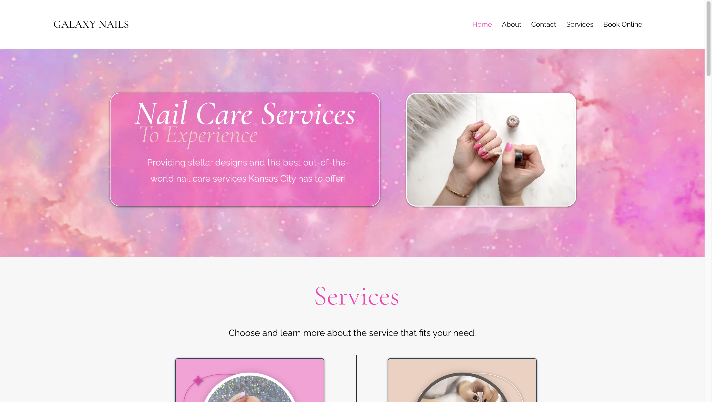

  
  
  
  
  

Former bartender to Software Engineer, I'm here to create a positive change with the tech, knowledge, and tools I've acquired.

See [my website](https://michaelnguyen.netlify.app/) for more information!

<h1 align="center">Projects</h1>
<table bordercolor="#66b2b2">
  
  <tr>
    <td width="50%" valign="top">
      <h3 align="center">MichaelNDev's Portfolio</h3>
         
        
         
        

          
  
      

        
<strong>Javascript, HTML5, CSS3</strong> - This is my personal portfolio if you're interested in learning more about me and what I'm currently up to.

    </td>
    <td width="50%" valign="top">
      <h3 align="center">TasteThreads</h3>
         
      
         
        

          
  
      

        
<strong>Express.js, MongoDB, EJS, Node, Javascript</strong> - This application facilitates a unique platform where users can share, rate, and critique specific menu items from local dining establishments, enhancing the culinary experience through communal insights.

    </td>
  </tr>
  
  <tr>
    <td width="50%" valign="top">
      <h3 align="center">Galaxy Nails</h3>
       
        
       
        

  
      

        
<strong>HTML5, CSS3, & Javascript</strong> - This website is expertly crafted for a nail salon, aiming to offer its clientele the added convenience of scheduling appointments through an online platform.

    </td>
    <td width="50%" valign="top">
      <h3 align="center">The Tao Tea Lounge</h3>
         
        
         
        

          
  
      

       
<strong>Javascript, HTML5, CSS3</strong> - A sleek and responsive web design for a cozy little teashop, perfectly blending its simple charm with the latest in website trends.

    </td>
  </tr>
</table>

<h1 align="center">Technologies</h1>

    
    
    
    
    
    
    
    
    

---

<h1 align="center">Connect</h1>

  
  
  
  
  

